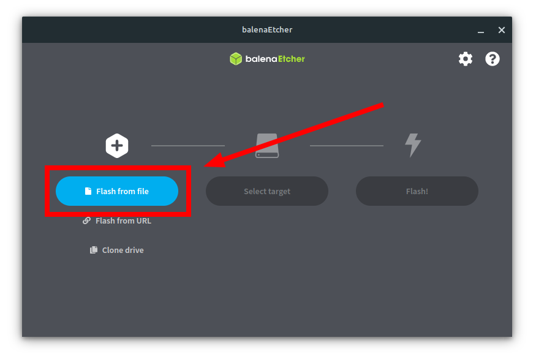
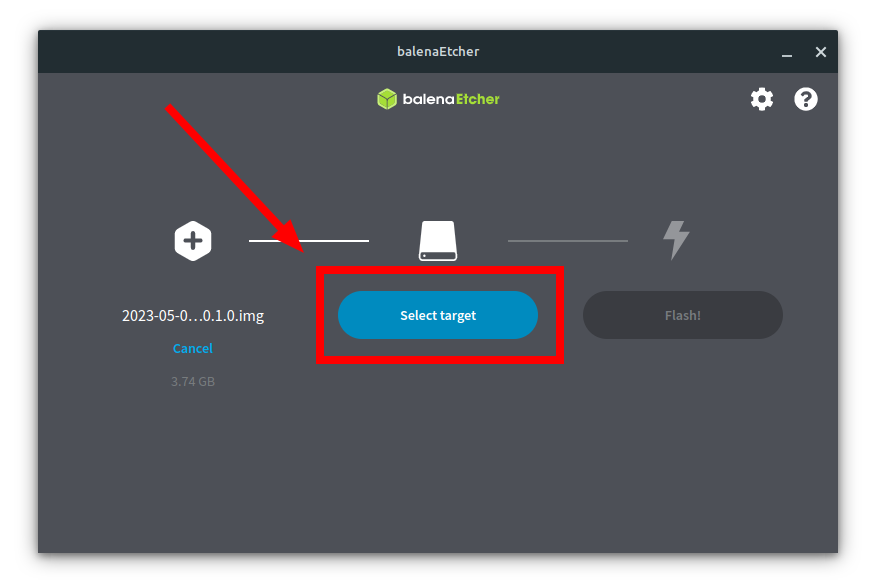
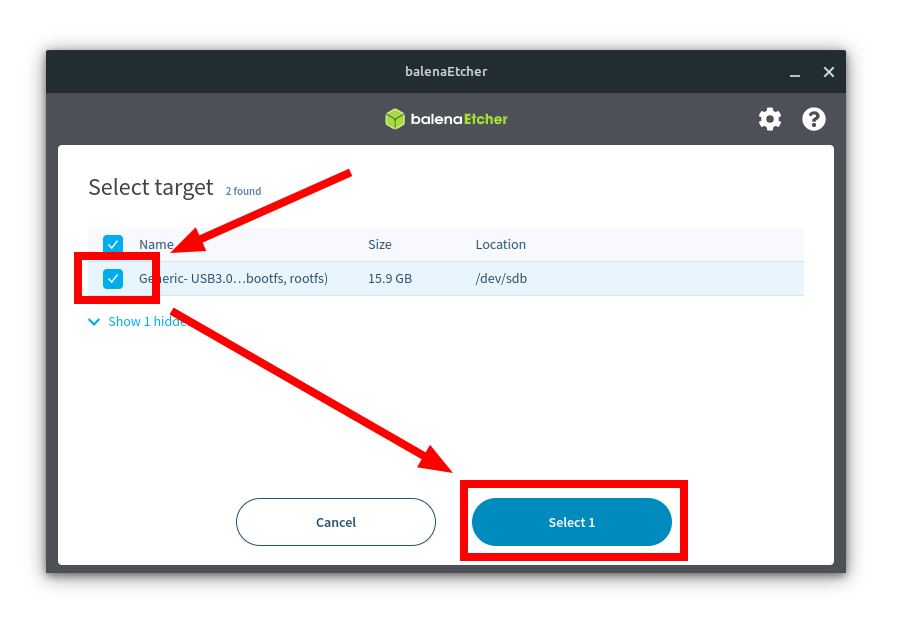
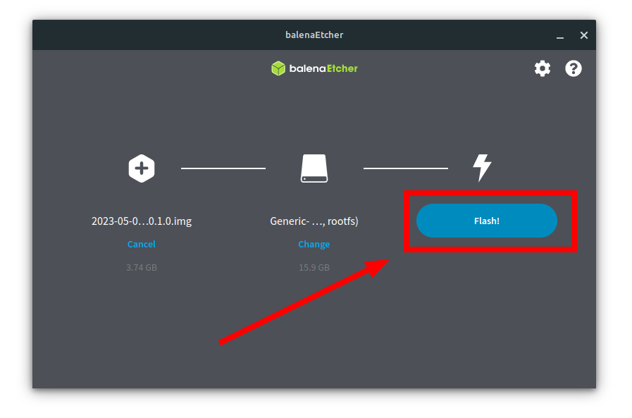
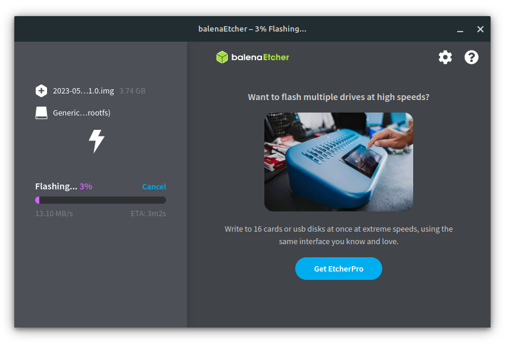
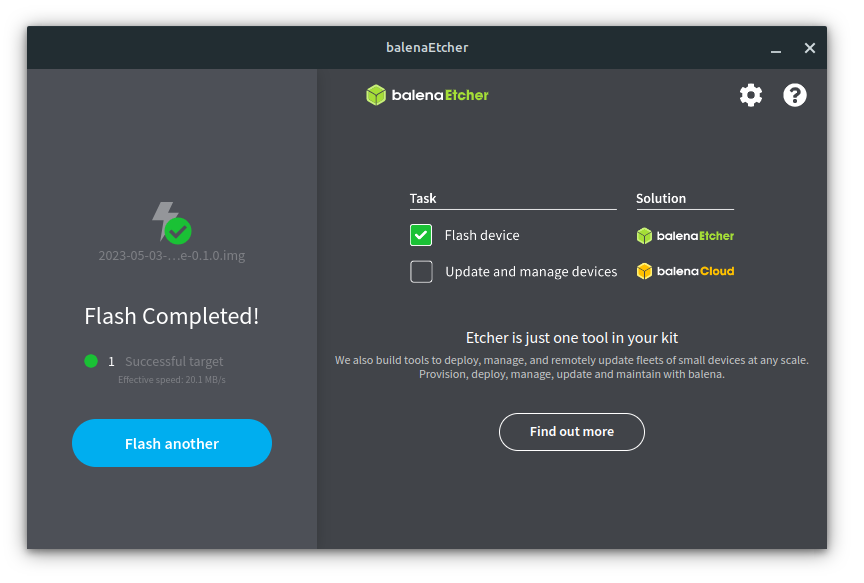

# Installation guide for PinToMindOS

## Prerequisites
It might be a good idea to buy a Raspberry Pi 4 starter kit. We recommend getting 
a model with at least 4 GB of RAM. If you choose to not buy a kit, you will need: 

- Raspberry Pi 4 (4/8 GB RAM, 2 GB might work, but is not recommended)
- Micro SD card (8 GB or more, preferably at least 16 GB)
- Power supply (USB-C, 5V, 3A, preferably the official one)
- Micro HDMI Cable or adapter
- Case (recommended)
- Ethernet cable (if wired network is used)

During setup, you will also need:

- A keyboard and mouse
- A MicroSD card reader
- A PC or Mac with SD card flashing software. We recommend using 
  [BalenaEtcher](https://www.balena.io/etcher/), which is also what we use in 
  this guide.

## Download and flash the image
1. If you haven't already, download and install BalenaEtcher from 
   [https://etcher.balena.io/](https://etcher.balena.io/).
2. Download the latest PinToMindOS image from Basecamp (`2023mmddfavopios.zip`). You do 
   not need to extract the file.
3. Insert your MicroSD card into your computer.
4. Open BalenaEtcher, and choose "Select image".  
   
5. Navigate to and select the zip file you downloaded in the second step.
6. Click "Select target".  
   
7. From the list of devices, select your SD card, and tick the checkbox next to it. Click "Select" 
   to confirm. **Warning: Make sure to select the right SD card, as all data on the device will 
   be deleted! Etcher tries to only display SD cards, but the detection is not 100% accurate.**
   
8. Click "Flash!" to start the flashing process. This will take a few minutes.  
   
9. Wait for the flashing to complete. It should show a success message when it's done.  
   
   
10. Once it has finished flashing, the SD card will be ejected, and you can safely remove 
    it. It is now ready for usage.

## Setup
Once the image has been flashed, remove it from your computer, and insert it into 
a Raspberry Pi. Connect the Raspberry Pi to a monitor, keyboard and mouse, and 
an Ethernet cable if you use wired networking. Finally, connect the power supply 
to the Pi to boot it. The Pi will now show a blue screen with some setup info, 
before showing a spinning icon. After a minute or two (could take longer if the SD 
card is slow), it should show the PinToMind setup screen. 

### Wired setup
If you use wired networking, you should be taken straight to the PinToMind setup 
screen, where it shows a unique setup code. On a different device, go to 
[https://app.pintomind.com](https://app.pintomind.com), and log in with your 
PinToMind account. Add a new screen, enter the setup code, and select a channel. 
Within seconds, you should be up and running successfully.

### Wireless setup
(TBD)

